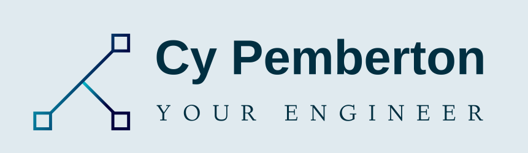

<!DOCTYPE HTML>

  
  
  
   
  <!--  -->
    

Previously a Project Engineer at Toyota, I am motivated by the power of technology as a tool for positive change, with a background in Engineering, and Project Management.

I develop full-stack websites and applications for a variety of local and national customers. I make sure my customers have a competitive, well-designed, and responsive web presence for their audience. My BSE and career experience as a project-focused mechanical engineer has given me diverse exposure to engineering workflows. This problem-solving background has been very useful in software engineering and application development. My path into software began when I attempted to learn Unreal Engine as a hobby. I realized I needed to expand the rudimentary programming skills I had acquired from PLCs and MatLab. I decided I enjoyed software and began to focus my efforts, eventually falling into full-stack development.
 

See [my website](https://cypemberton.com/) for more information!

<h1 align="center">Projects</h1>
<table bordercolor="#66b2b2">
  
  <tr>
    <td width="50%" valign="top">
      <h3 align="center">Cuts and Curls</h3>
         
        
         
        

          
    
  
      

        
<strong>Javascript, HTML, CSS</strong> - Website for a high-end hair salon.

    </td>
    <td width="50%" valign="top">
      <h3 align="center">StreamLook</h3>
         
      
         
        

          
  
  
      

        
<strong>Javascript, HTML, CSS</strong> - Web-application allowing users to search movie or show titles and find where they are available for streaming.

    </td>
  </tr>
  
  <tr>
    <td width="50%" valign="top">
      <h3 align="center">ShotSearch</h3>
         
        
         
        

          
  
  
      

        
<strong>HTML5, CSS3, & Javascript</strong> - Web-application allowing users to search for cocktails using ingrediants or alcohols and get instructions and measures for mixing.

    </td>
    <td width="50%" valign="top">
      <h3 align="center">João's Steakhouse</h3>
       
        
       
        

  
  
      

        
<strong>HTML5, CSS3, & Javascript</strong> - Simple landing page for a brazillian steakhouse.

    </td>
  </tr>
</table>

<h1 align="center">Technologies</h1>

    
    
<!--      -->
<!--      -->
    
    
<!--      -->
    
<!--      -->
<!--      -->
<!--      -->
<!--      -->
<!--      -->
<!--      -->
    
    
<!--      -->
<!--      -->
    
<!--      -->

---

<h1 align="center">Connect</h1>

  
  
  
  <!--  -->
  

